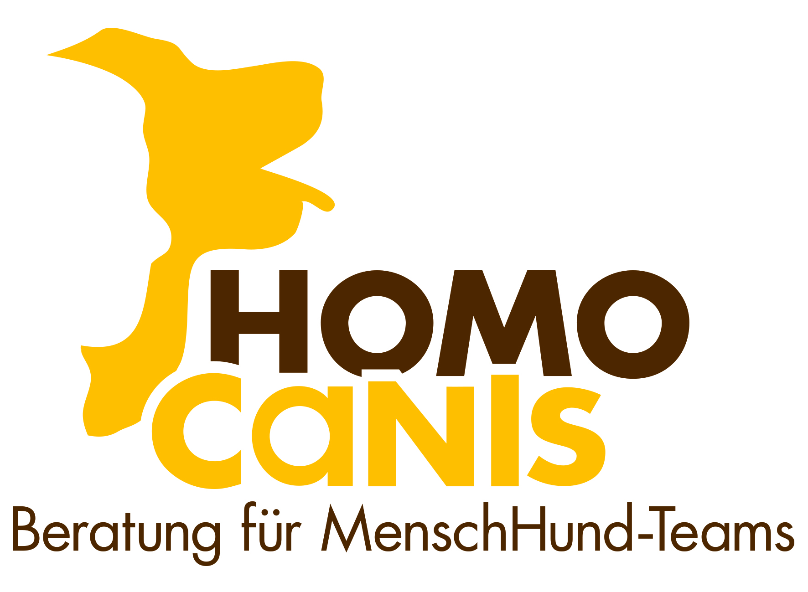

# Logo Information

## HomoCanis Logo Setup

### Required File
Place the HomoCanis logo file in this directory:
- **Filename**: `HomoCanis.jpg`
- **Location**: `frontend/HomoCanis.jpg`
- **Recommended size**: 200-300px height (will be displayed at 50px height)
- **Format**: JPG, PNG, or SVG

### Alternative Formats
If you have the logo in a different format, you can use:
- `HomoCanis.png` - Recommended for logos with transparency
- `HomoCanis.svg` - Best for scalability

If using a different format, update the reference in `frontend/index.html` line 24:
```html

```

### Logo Display
The logo will appear in the navbar at:
- **Height**: 50px (auto-width to maintain aspect ratio)
- **Position**: Left side of navbar, before "Dog Mentality Test" text
- **Styling**: Object-fit: contain (preserves aspect ratio)

### Color Scheme
The design uses HomoCanis brand colors:
- **Primary**: #2c5f8d (Professional blue)
- **Secondary**: #7a9eb8 (Light blue)
- **Success**: #5a9367 (Green)
- **Background**: #f5f7f9 (Light gray)
- **White navbar** with subtle shadow

### If Logo is Missing
If the logo file is not present, the browser will show:
- A broken image icon
- The alt text "HomoCanis"
- The "Dog Mentality Test" text will still display correctly

You can temporarily remove the img tag or add a placeholder image until the actual logo is available.
